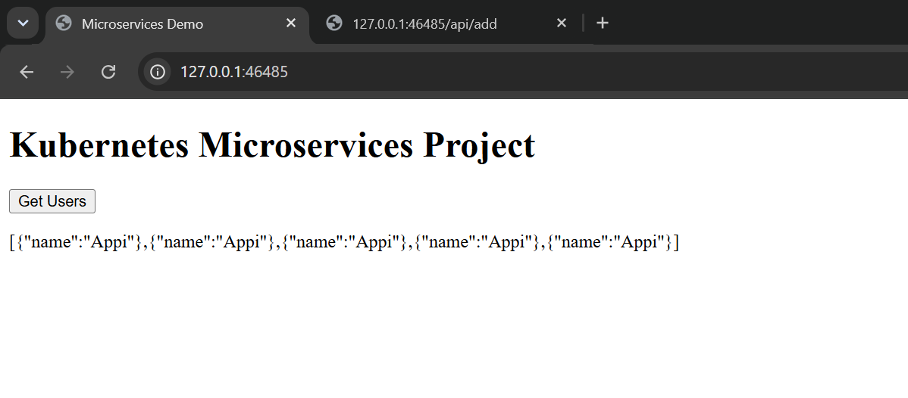
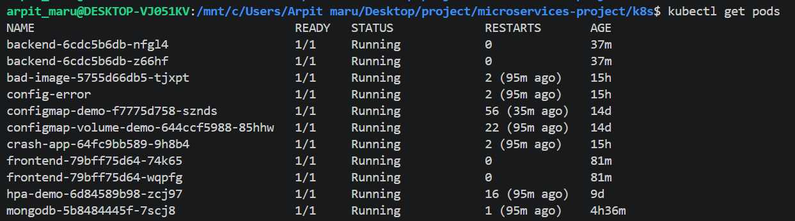
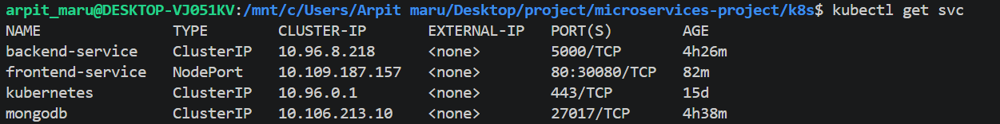
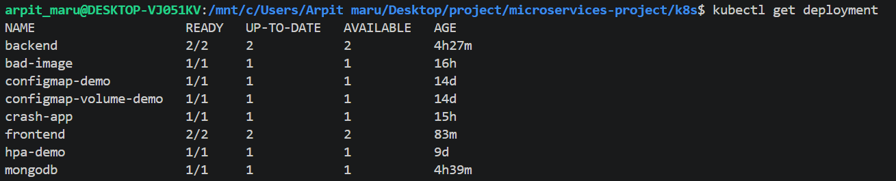

# Kubernetes Microservices Project

A production-style microservices application deployed on Kubernetes using Flask, MongoDB, and Nginx.

## Architecture

```
Browser
    │
    ▼
Frontend (Nginx)
    │
    ▼
Backend (Flask API)
    │
    ▼
MongoDB
```

## Tech Stack

- Kubernetes
- Docker
- Python Flask
- MongoDB
- Nginx
- ConfigMap
- Secret

## Project Structure

```
microservices-project/
│
├── backend/
│   ├── app.py
│   ├── Dockerfile
│   └── requirements.txt
│
├── frontend/
│   ├── index.html
│   ├── nginx.conf
│   └── Dockerfile
│
├── k8s/
│   ├── backend.yaml
│   ├── frontend.yaml
│   ├── mongodb.yaml
│   ├── configmap.yaml
│   └── secret.yaml
│
└── README.md
```

## Features

- Frontend served by Nginx
- Flask REST API
- MongoDB database
- ConfigMap for configuration
- Secret for credentials
- Kubernetes Service Discovery
- Multi-tier Microservices Architecture

## Deployment

```bash
kubectl apply -f k8s/
```

## Verify

```bash
kubectl get pods
kubectl get svc
```

## Test

Open the frontend service.

Click **Get Users**.

Expected output:

```json
[
  {
    "name": "Appi"
  }
]
```

## Learning Outcomes

- Docker Image Creation
- Kubernetes Deployments
- Services
- ConfigMaps
- Secrets
- MongoDB Integration
- Nginx Reverse Proxy
- Kubernetes DNS
- Rolling Updates
- Debugging Kubernetes Applications


# Screenshots

## Application



## Kubernetes Pods



## Services



## Deployments


